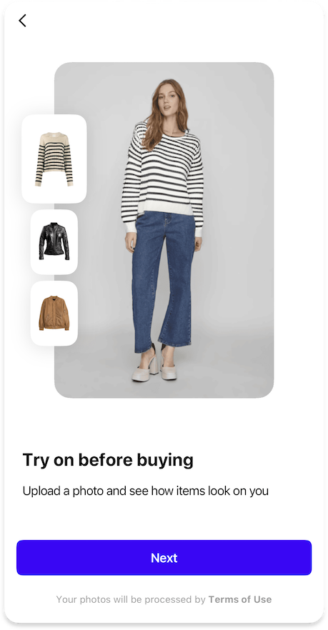
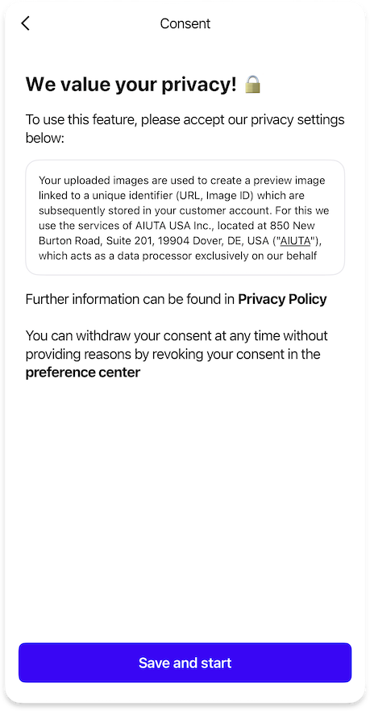
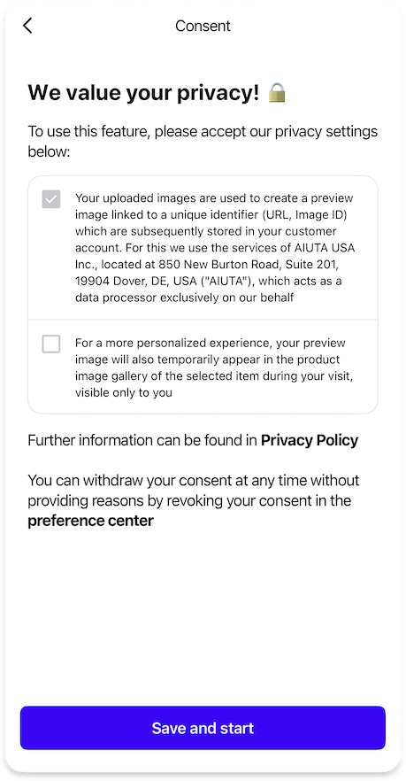
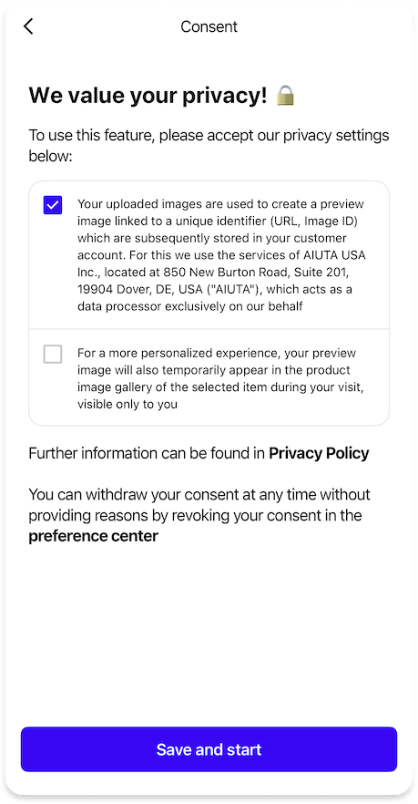

# Consent or Legal information

The Consent feature allows you to collect user permissions for data processing or simply provide the user with legal information. It can be integrated into onboarding, displayed as a standalone page, or shown in a bottom sheet when specific actions are performed.

=== "Embedded legal info (default)"

    ## Embedded

    { width=300 }

    The legal information is displayed at the bottom of the onboarding screen. Users are not required to explicitly accept the terms to proceed.

    !!! info ""
        This is default

    ### When to Use

    - Present terms of service and/or privacy policies

    ---

    ??? tip "Customization"

        ### Customization

        ##### [Text Elements](../resources/localization.md)
        - `consentHtml` content with concise text and links to privacy policy and/or terms of service

=== "Standalone consent page (extended)"

    ## Standalone

    {width=300}

    A dedicated page where users must accept the terms by selecting required checkboxes to continue.
    It can be configured to appear:

      1. When users are about to upload their photo in the image picker [^1]
      2. As the last slide of the onboarding (if enabled)
      3. After the welcome screen (if enabled)
      4. If 2 and 3 are disabled, as the first screen when opening the SDK

    ### When to Use

    - Collect user permissions for data processing
    - Ensure compliance with data protection regulations
    - Get explicit user consent for specific features
    - Present terms of service and privacy policies

    ---        

    ### Consent Data

    Each consent is defined by the following properties:

    - `id` - A unique identifier for the consent
    - `type` - The method used to obtain the consent
    - `html` - The HTML content describing the consent

    ??? abstract "Consent Type"

        === "`explicit`"

            Represents consent where the user must actively check a checkbox to provide permission. This is required for cases where consent must be freely given and unambiguous.

            - `required` - Indicates whether the checkbox must be checked to proceed
            - `optional` - Indicates additional consent and the user may proceed without checking it

            {width=300}

            !!! info "GDPR Compliance"
                The checkbox must be explicitly selected by the user as pre-selected checkboxes are not valid under GDPR, even if the user presses an "Accept" button. 

        === "`implicit`"

            Represents consent where the user provides permission by pressing an "Accept" button. This may optionally include a __disabled__ (pre-selected) checkbox for additional clarity.

            === "Single consent without checkbox"

                {width=300}

            === "Necessary and additional consent with checkboxes"

                {width=300}   

            ??? warning "Legal Considerations"
                It can be just an "Accept" button, but only if it’s very clear exactly
                what the user is consenting to at that moment and you can’t bundle
                multiple consents into one "Accept" unless they’re strictly necessary.
                For example, GDPR says marketing consent should always be separate if possible.

                This can be used only for the consent that is necessary for the service,
                as it’s not really “consent” under GDPR and it’s processing based on
                contract necessity (Article 6(1)(b)) or legal obligation, not based on
                “freely given consent” (Article 6(1)(a)), so, it is just informing the users,
                not asking them for an additional permission.
            
                Please consider that this option at all (with or w/o checkbox)
                is not valid for all cases, and it should be used with caution.
                Consult with a legal department if in doubt.

    ---

    ### Data Management

    === "Built-in"

        By default, the SDK uses platforms' local storage to store information about the consents obtained from the user. This is the simplest approach and requires no additional configuration.

    === "Data Provider"

        You can implement your own custom data provider that:

        - Provides the `obtainedConsentsIds` list of consents identifiers already obtained from the user
        - React to the `obtainConsentsIds` callback with the list of consents identifiers that the user agreed to and pressed the accept button

        !!! info "This allows you to"
            - Integrate with your existing user management system
            - Sync the consent status across devices
            - Reset consent status whenever you want to show the consent screen again

        !!! question ""
            See the [How to implement](#how-to-implement) section at the bottom for information on the relevant platform.

    ??? question "How does the SDK decide when to request consent?"
        SDK will match the consents identifiers with the ones already obtained from the user (e.g., `obtainedConsentsIds`) and will show the consent page only if there are missing `explicit` `required` or any `implicit` consents.

    ??? question "What happens if the consent data changes?"
        Overall, the logic behind the answer to the previous question seems to be consistent:
        
        - If a new `explicit` `required` or `implicit` consent is added, the SDK will request the user's consent again, since it is not in the list of accepted consents. None of the old checkboxes will be pre-selected, and the user will need to accept all the necessary ones again.

        - A new `optional` consent will be ignored so as not to disturb users who have already accepted the mandatory ones.

        - If any of the mandatory ones have changed their terms... Well, that's bad practice, please don't do that. The SDK does not monitor the content of consents, only their identifiers. If you need to change the terms, delete the old consent and create a new one with a different `id`.

        - When changing the consent `type`, the logic is preserved. If it becomes `optional`, no reaction will follow. If an `optional` consent becomes any of mandatory type, the SDK will request everything again.

    ---

    ??? tip "Customization"

        ### Customization

        ##### [Text Elements](../resources/localization.md)
        - Optional `consentPageTitle`
        - Main `consentTitle` displayed on the top
        - `consentDescriptionHtml` content above the consents list
        - Optional `consentFooterHtml` below the consents list
        - Text for the `consentButtonAccept`

        ##### [Styles](../resources/other.md)
        - Optional `drawBordersAroundConsents`

        === "Without borders"

            {width=300}

        === "With borders"

            {width=300}    

    ---

    ## [Analytics](../analytics/analytics.md)

    The following analytics events may be tracked during consent collection:

    | Type | Event | Page Id | Description |
    |------|-------|---------|-------------|
    | [`page`](../analytics/analytics.md#event-categories) | :material-minus: | [`consent`](../analytics/analytics.md#page-identifiers) | Consent page opened |
    | [`onboarding`](../analytics/analytics.md#event-categories) | [`consentsGiven`](../analytics/analytics.md#onboarding-events) | [`consent`](../analytics/analytics.md#page-identifiers) | User has given all required consents |
    | [`exit`](../analytics/analytics.md#event-categories) | :material-minus: | [`consent`](../analytics/analytics.md#page-identifiers) | SDK was closed on the consent page |

---

## How to implement

- :fontawesome-brands-android: __Android__
- :fontawesome-brands-apple: __iOS__
- :fontawesome-brands-flutter: __Flutter__

 [^1]: We recommend using the consent display via the "upload photo" button if you are using try-ons with models feature. In this case, the user has the option not to use personal photos and there is no need to request consent in advance, as the service has the right to operate without it.
