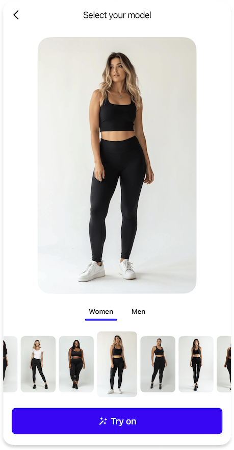
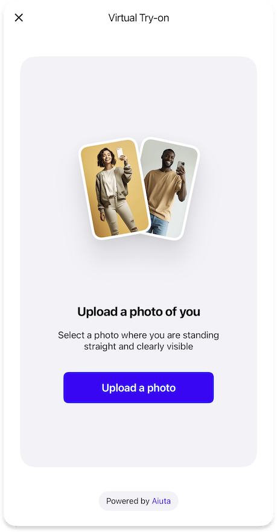

# Image Picker

{width=300}
{width=300}

The Image Picker feature represents the main page and allows users to select images for virtual try-on from various sources.

## When to Use

- Let users select photos from their device
- Allow users to take new photos with the camera
- :material-new-box:{ .cl-aiuta } Provide predefined models images for try-on
- Enable users to reuse and manage previous images

## Sources

=== "Camera"

    ### Camera

    {width=300}

    Allows users to take new photos using their device's camera. Uses the platform's standard camera tools for applications.

    ---

    ??? tip "Customization"

        #### Customization

        ##### [Icons](../resources/icons.md)
        - `camera24` - Icon for the camera button in the bottom sheet list

        ##### [Text Elements](../resources/localization.md)
        - `cameraButtonTakePhoto` - Label for the button used to take a photo
        - `cameraPermissionTitle` - Title for the camera permission alert
        - `cameraPermissionDescription` - Description for the camera permission alert
        - `cameraPermissionButtonOpenSettings` - Label for the button that opens app settings

=== "Gallery"

    ### Photo library

    {width=300}

    Enables users to select photos from their device's photo library. Uses the platform's standard photo picker.

    ---

    ??? tip "Customization"

        #### Customization

        ##### [Icons](../resources/icons.md)
        - `gallery24` - Icon for the gallery button in the bottom sheet list

        ##### [Text Elements](../resources/localization.md)
        - `galleryButtonSelectPhoto` - Label for the button used to select a photo

=== "Predefined Models"

    ### Predefined Models

    === "Enabled (default)"
        
        {width=300}
        {width=300}

        Provides a selection of predefined models images for virtual try-on. Models are divided into categories, each containing a set of model images with different body shapes. This allows users to select models that best match their preferences and needs, offering a personalized virtual try-on experience, while allowing them not to use their own photos.

        #### Models data

        The SDK gets categories and the corresponding model lists from the Aiuta backend.
        Apps don't need to provide any data for this.

        !!! info ""
            By __default__, there two categories: `woman` and `man` in that order. 
            If necessary, categories can be fully customized in agreement with Aiuta.

        ??? warning "Predefined models, History and User data"
            If you use your __own__ history `data provider` and __manage__ image files when they are added to or deleted from the user's history, please note:

            - The link to the image used with the model can be saved in the user's history
            - The file with the model image should not be moved to the user's storage, it is a shared file and does not belong to a specific user
            - When deleting from the user's history, the link to the image must be deleted, but the file with the model image itself cannot be deleted

        ---

        ??? tip "Customization"

            #### Customization

            ##### [Icons](../resources/icons.md)
            - `selectModels24` - Icon for the predefined models button

            ##### [Text Elements](../resources/localization.md)
            - `predefinedModelsTitle` - Title of the predefined models page and button
            - `predefinedModelsOr` - Label displayed before the predefined models button
            - `predefinedModelsEmptyListError` - Error message for empty model list
            - `predefinedModelsCategories` - Mapping of category IDs to titles (e.g., "man", "woman")

    === "Disabled"
        
        {width=300}

=== "Uploads History"

    ### Uploads History

    {width=300}
    {width=300}

    Allows users to access and reuse their previously used images. 
    The last image used will be preselected in the image picker for subsequent try-ons.

    ---

    #### History Data

    Each image in the history is defined by the following properties:

    - `id` - A unique identifier for the image
    - `url` - The address of an image resource
    - `type` - The type of the image. 
    
    ??? abstract "Image Type"
        Is this context of images used as input it is:

        === "`uploaded`"
            Image uploaded by the user (taken from the camera or gallery). This image belongs to the user. When the user removes the image from the history, it should be deleted from the storage as well.

        === "`inputModel`"
            Image of the model, provided by the Aiuta. This image could be linked to the user history, but it is not owned by the user, and should not be deleted, only unlinked from the user's history in case of removing.

    #### Data Management

    === "Built-in"

        By default, the SDK uses platforms' local storage to store the history. This is the simplest approach and requires no additional configuration.

        !!! warning "Anonymous data"

            Neither the SDK nor the Aiuta API have any information about your users; all uploaded images are completely anonymous and are not linked to any user. Data in the history is stored locally on the device and may be lost when the app is reinstalled.

            If you need to link images to a user profile, use Data Provider instead.

    === "Data Provider"

        You can implement your own custom history data provider that:

        - Provides the `uploadedImages` list of images previously used by the user
        - Reacts to the `addUploadedImages` callback to store new images
        - Reacts to the `deleteUploadedImages` callback to remove images by the user choise
        - Reacts to the `selectUploadedImage` callback to reorder images when reused

        !!! info "This allows you to"
            - Integrate with your existing user management system
            - Sync the uploads history across devices
            - Implement custom business logic for history management
            - Control how images are stored and accessed

    ---

    ??? tip "Customization"

        #### Customization

        ##### [Text Elements](../resources/localization.md)
        - `uploadsHistoryButtonNewPhoto` - Text for the new photo button
        - `uploadsHistoryTitle` - Title for the uploads history screen
        - `uploadsHistoryButtonChangePhoto` - Text for the change photo button

        ##### [Styles](#)
        - `changePhotoButtonStyle` - Style for the "Change Photo" button:
            - `blurred` - Default blurred style with optional outline
            - `primary` - Solid button with primary background color
---

## [Analytics](../analytics/analytics.md)

The following analytics events are tracked during image selection:

| Type | Event | Page Id | Description |
|------|-------|---------|-------------|
| [`page`](../analytics/analytics.md#event-categories) | :material-minus: | [`imagePicker`](../analytics/analytics.md#page-identifiers) | Image picker page opened |
| [`picker`](../analytics/analytics.md#event-categories) | [`cameraOpened`](../analytics/analytics.md#picker-events) | [`imagePicker`](../analytics/analytics.md#page-identifiers) | Camera interface opened |
| [`picker`](../analytics/analytics.md#event-categories) | [`newPhotoTaken`](../analytics/analytics.md#picker-events) | [`imagePicker`](../analytics/analytics.md#page-identifiers) | New photo taken with camera |
| [`picker`](../analytics/analytics.md#event-categories) | [`photoGalleryOpened`](../analytics/analytics.md#picker-events) | [`imagePicker`](../analytics/analytics.md#page-identifiers) | Photo gallery opened |
| [`picker`](../analytics/analytics.md#event-categories) | [`galleryPhotoSelected`](../analytics/analytics.md#picker-events) | [`imagePicker`](../analytics/analytics.md#page-identifiers) | Photo selected from gallery |
| [`picker`](../analytics/analytics.md#event-categories) | [`uploadsHistoryOpened`](../analytics/analytics.md#picker-events) | [`imagePicker`](../analytics/analytics.md#page-identifiers) | Uploads history opened |
| [`picker`](../analytics/analytics.md#event-categories) | [`uploadedPhotoSelected`](../analytics/analytics.md#picker-events) | [`imagePicker`](../analytics/analytics.md#page-identifiers) | Previously used photo selected |
| [`picker`](../analytics/analytics.md#event-categories) | [`uploadedPhotoDeleted`](../analytics/analytics.md#picker-events) | [`imagePicker`](../analytics/analytics.md#page-identifiers) | Previously used photo deleted |
| [`picker`](../analytics/analytics.md#event-categories) | [`predefinedModelsOpened`](../analytics/analytics.md#picker-events) | [`imagePicker`](../analytics/analytics.md#page-identifiers) | Predefined models list opened |
| [`picker`](../analytics/analytics.md#event-categories) | [`predefinedModelSelected`](../analytics/analytics.md#picker-events) | [`imagePicker`](../analytics/analytics.md#page-identifiers) | Predefined model selected |
| [`exit`](../analytics/analytics.md#event-categories) | :material-minus: | [`imagePicker`](../analytics/analytics.md#page-identifiers) | SDK was closed on the image picker page |

---

## How to implement

- :fontawesome-brands-android: __Android__
- :fontawesome-brands-apple: __iOS__
- :fontawesome-brands-flutter: __Flutter__

